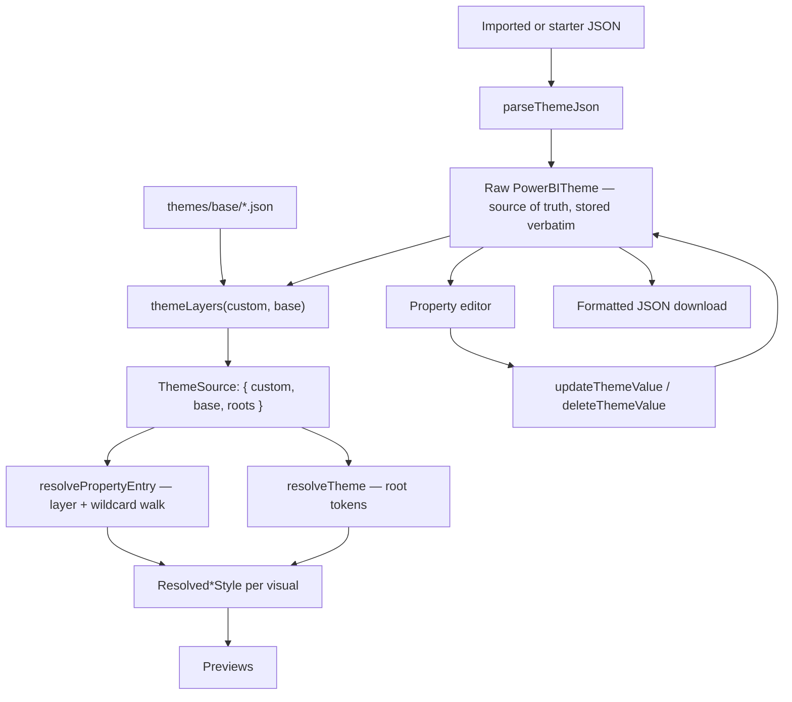

# Power BI Theme Studio — Project Overview

## Purpose

Power BI Theme Studio is a local, browser-only editor for Power BI JSON theme
files. It shows representative renderings of common report visuals, exposes the
real `visualStyles` formatting properties behind them, and exports the updated
JSON without discarding any part of the original theme.

The design goal is **accuracy of the theme model**, not fidelity of the
rendering engine. The previews exist to make a theme change visible; they are
deliberately simple HTML/SVG approximations, not a reimplementation of Power BI
Desktop. What must be exactly right is which JSON property is read, how it is
resolved, and what is written back.

## Current user journey

1. Open the application with the bundled starter theme loaded.
2. Optionally import a Power BI `.json` theme from the browser.
3. Choose which **base theme** supplies the defaults — Classic 2026 (default),
   Classic 2018, or Fluent 2. Anything the theme does not set is inherited from
   the base rather than from this tool's own guesses.
4. Use the left-hand rail to choose which of the 16 visuals sit on the canvas
   and which one previews large.
5. Pick a format-pane-style group in the property panel (e.g. "Y axis", "Data
   labels") and edit its properties in the detail view.
6. See the previews update immediately.
7. Export the current theme as formatted JSON.

Invalid JSON and non-object JSON roots are rejected with a user-facing error.
The **Reset starter** action restores the bundled starter theme.

## Architecture



The raw `PowerBITheme` is the single source of truth and is **never
normalised**. The base theme is layered on for *resolution only*; it never
enters the exported file. Edits are path-addressed writes into an immutable
clone, so every property outside the current UI survives untouched.

## Theme resolution

This is the part of the system most likely to be broken by a well-intentioned
change, so it is documented in detail.

### Layers, not a merge

Power BI's authoring reference orders matches like this:

```
custom exact/preset → custom exact/*  → custom wildcard/preset
→ custom wildcard/* → base  exact/*   → base  wildcard/*  → system default
```

The consequence that trips people up: **the layer axis dominates the
specificity axis.** A custom *wildcard* value outranks a base *visual-specific*
value, because every custom-theme match is considered before any base-theme
match.

That ordering cannot be expressed by merging the two themes first — a merge
discards which layer each value came from. So `visualStyles` resolution takes a
`ThemeSource` carrying `custom` and `base` separately, and walks four steps in
order:

| Step | `PropertySource` |
| --- | --- |
| 1 | `custom-visual` |
| 2 | `custom-wildcard` |
| 3 | `base-visual` |
| 4 | `base-wildcard` |
| — | `fallback` (this app's coded default) |

`tests/layerPrecedence.test.ts` pins this, including a test asserting that
resolving a *merged* theme gets the case **wrong** — so the merge path is not
reinstated by mistake.

`mergeThemeOverBase` still exists and is still correct, but only for
**root-level reads** (`dataColors`, semantic colours, `textClasses`), where
custom-over-base merging is exactly the right semantics. Its result is exposed
as `ThemeSource.roots` and is never exported.

### Provenance

`resolvePropertyEntry` returns `{ value, source, isSet }` rather than a bare
value. `isSet` is the important field: a bare value cannot distinguish an
explicit `false`, `0` or `""` from a property nobody ever set. That ambiguity
previously forced the renderer to read raw theme JSON directly, and repeatedly
caused features to render as though enabled when nothing had enabled them.

`isGroupSetBy(source, visual, group, "custom" | "any")` answers "did anyone
configure this group?" — with the layer scope mattering. A base theme ships
`smallMultiplesLayout` styling so the feature looks right *if used*, which is
not a signal that anything turned it on. Only the custom layer expresses intent.

`resolvePropertyValue` remains as a thin wrapper returning `.value`, so the
thousands of existing registry call sites are unchanged and the value and its
provenance can never disagree.

### Per-state entries and `$id`

Power BI stores interaction states as several entries in one array, each tagged
with an `$id`:

```json
"fill": [
  { "show": true },
  { "$id": "default",  "fillColor": { "solid": { "color": "#0B0C0C" } } },
  { "$id": "hover",    "fillColor": { "solid": { "color": "#1D70B8" } } }
]
```

Nothing in the format requires two themes to declare the same states, in the
same order, or at all. **An entry's array position therefore carries no
cross-theme meaning.** Reads locate a state by `$id` *within each layer
independently* (`forStateId`); a state absent from a layer falls through to the
next layer rather than defaulting to index 0. An untagged entry stands in for
any state, which is how group-wide settings and state-unaware themes are
written.

Writes are a separate matter: they stay index-based against the user's own raw
theme, so `updateThemeValue` patches exactly that entry and the file round-trips
unchanged. Vocabulary differs by group — `default`/`hover`/`selected`/`disabled`
for buttons and navigators, `Applied`/`Available` for filter cards.

### Colour values

Three forms occur in real themes and all three are handled by
`resolveColorValue`:

| Form | Example |
| --- | --- |
| Literal hex (6- or 8-digit) | `{ "solid": { "color": "#1D70B8" } }` |
| Named theme token | `{ "solid": { "color": "foregroundNeutralSecondary" } }` |
| `ThemeDataColor` expression | `{ "solid": { "color": { "expr": { "ThemeDataColor": { "ColorId": 2, "Percent": -0.2 } } } } }` |

Tokens resolve against the *merged* root view, so a token written in the base
theme correctly picks up the user's overridden palette. `Percent` applies a
tint or shade via `tintOrShade` in `colorUtils.ts`.

`ColorId` is treated as a 0-based index into `dataColors`. See
`ARCHITECTURE_REVIEW.md` §9.5 — this reading is not fully settled and is
isolated so it can be changed in one place.

## Application structure

| Path | Responsibility |
| --- | --- |
| `app/main.tsx` | Browser mount point; renders `ThemeStudio` under React `StrictMode`. |
| `app/components/ThemeStudio.tsx` | Import/export, editor state, base-theme selection, and all resolver wiring. |
| `app/components/VisualRail.tsx` | Left-hand picker for canvas membership and hero selection. |
| `app/components/VisualPreviews.tsx` | The 16 visual previews and the shared `PreviewShell` chrome. |
| `app/components/GlobalPreviews.tsx` | Filter pane and colour-reference previews for theme-level settings. |
| `app/components/PropertyEditor.tsx` | Master-detail property panel; writes raw theme paths. |
| `app/components/ChartParts.tsx` | Shared axis, gridline, legend and data-label primitives. |
| `app/lib/theme.ts` | Types, parsing, `resolveTheme`, immutable updates, `mergeThemeOverBase`. |
| `app/lib/properties.ts` | The resolution engine: layers, provenance, `$id` matching, write helpers. |
| `app/lib/baseThemes.ts` | The three bundled base themes and the default selection. |
| `app/lib/*Properties.ts` | One property registry per visual, plus chrome, global options and theme globals. |
| `app/lib/colorUtils.ts` | Transparency compositing and `ThemeDataColor` tint/shade. |
| `app/lib/shapeGeometry.ts`, `lineGeometry.ts` | Pure geometry for shapes and line/area charts. |
| `app/globals.css` | All application and preview styling; no component library. |
| `themes/base/*.json` | Classic 2018, Classic 2026 and Fluent 2, extracted from Power BI Desktop. |
| `public/fixtures/starter-theme.json` | Small shareable development fixture. |

## Base themes

| Selection | File | Power BI identifier |
| --- | --- | --- |
| Classic 2026 *(default)* | `themes/base/classic2026.json` | `CY26SU07` |
| Classic 2018 | `themes/base/classic2018.json` | `CY18SU07` |
| Fluent 2 (Preview) | `themes/base/fluent2.json` | `Fluent2-CY26SU07` |

These were extracted from a real Power BI Desktop installation rather than
reconstructed, and are reference data — treat them as read-only. Adding a newer
base theme means dropping the JSON into `themes/base/`, adding one entry to
`BASE_THEMES` in `baseThemes.ts`, and moving `DEFAULT_BASE_THEME_ID` if it
should become the default.

Note that these files do **not** validate cleanly against Microsoft's own
published report-theme schema (see `ARCHITECTURE_REVIEW.md` §9.6). That is a
gap in the schema, not corruption of the fixtures.

## Property registries

Registries are declarative metadata, not code paths. Each entry pins a property
to its real schema path, its value type, its format-pane group and section, and
a label and description:

```ts
labelColor: colorProp("clusteredBarChart", ["categoryAxis", 0, "labelColor"], { … })
```

`PropertyEditor` is generic over this metadata, which is why adding properties
does not mean adding UI code.

| Registry | Definitions |
| --- | --- |
| Line chart | 430 |
| Clustered bar / Clustered column | 297 each |
| Stacked bar / Stacked column | 296 each |
| Matrix | 146 |
| Shared chrome | 135 |
| Slicer | 99 |
| Table | 73 |
| Action button / Page navigator | 68 each |
| Bookmark navigator | 67 |
| Shape | 56 |
| Text classes | 56 |
| Global options | 38 |
| Pie | 36 |
| Semantic theme colours | 32 |
| Image | 26 |
| Card | 19 |
| Textbox | 3 |
| **Total** | **~2,538** |

`shapeFamilyProperties.ts` is a shared composition helper used by the
shape-like visuals rather than a registry of its own; its properties are counted
within the visuals that compose it.

Registries are pinned to Microsoft's published `reportThemeSchema-2.156.json`
from `microsoft/powerbi-desktop-samples`. Each file documents the fields it
deliberately excludes and why — generally complex nested objects, genuinely
polymorphic types, or per-instance state rather than a stylistic default.

## Preservation behaviour

This is the invariant the product depends on:

- The imported theme is stored **verbatim** and never normalised, reconstructed
  or round-tripped through an internal model.
- `updateThemeValue` deep-clones and changes only the requested path;
  `deleteThemeValue` removes only that path.
- The base theme is a *resolution input only* and never enters the export.
- Unknown visual types, style-preset buckets and vendor-specific root keys all
  survive export untouched.

This is verified by tests, not just by intent.

## Runtime, build, and deployment

A standard React 19 + TypeScript + Vite 8 single-page application. No server
rendering, Worker entry point, database, authentication layer, or backend API.

| Command | Purpose |
| --- | --- |
| `npm install` | Install the locked project dependencies. |
| `npm run dev` | Start the Vite development server (normally `http://localhost:5173`). |
| `npm run build` | Type-check and create the static production output in `dist/`. |
| `npm run start` | Preview the static Vite build locally. |
| `npm run lint` | Run ESLint. |
| `npm test` | Build, then run the full test suite. |

Node.js 22.13 or newer is required. For Cloudflare Pages, configure the React
(Vite) build settings with build command `npm run build` and output directory
`dist`.

## Testing

**206 tests**, discovered by glob (`tests/**/*.test.ts`, `tests/**/*.test.mjs`)
so a new file cannot be added without being run — it previously could, and one
file went un-run for its entire life.

The convention is one test file per registry, plus focused files for the
resolution engine:

| File | Covers |
| --- | --- |
| `layerPrecedence.test.ts` | Custom-vs-base ordering in both directions |
| `stateIdMatching.test.ts` | `$id` resolution across layers, incl. real Fluent 2 fixture |
| `provenance.test.ts` | `source` / `isSet`, explicit `0` and `false` |
| `wildcardBucket.test.ts` | `visualStyles["*"]["*"]` participation |
| `themeColorValues.test.ts` | Tokens, `ThemeDataColor`, `Percent` shading |
| `theme.test.ts`, `properties.test.ts` | Parsing, updates, engine primitives |
| `mergeThemeOverBase.test.ts` | Merge semantics and non-mutation |
| `*Properties.test.ts` | One per registry |
| `shapeGeometry`, `lineGeometry`, `chartParts` | Pure geometry and chart primitives |
| `static-output.test.mjs` | Production build emits a static Vite entry point |

Regression tests for the resolution engine use **real base-theme fixtures**
rather than synthetic ones wherever the behaviour depends on what Microsoft
actually ships.

There is no automated browser interaction test; verification of rendering is
manual.

## Theme-file handling and repository hygiene

Real or private themes belong in `themes/local/`, which is Git-ignored. Only
sanitized, shareable examples belong in `themes/examples/`. `themes/base/` is
reference data. The bundled starter fixture is intentionally small and is not a
replacement for a complete project theme.

## Deliberately deferred work

- **Style presets.** Named preset buckets (`visualStyles[type][preset]`)
  round-trip untouched but are never read, and there is no preset picker.
- **A declarative property → rendered-element map.** Nothing asserts that a
  property with an obvious visual effect is actually bound to something in a
  preview. This is the largest remaining conceptual gap
  (`ARCHITECTURE_REVIEW.md` §3.4).
- Visual coverage beyond the current 16 — `cardVisual`, `donutChart`,
  `areaChart`, `kpi` and `multiRowCard` are the most valuable next additions.
- Registry consolidation — the four cartesian registries are ~72% identical and
  have already drifted in two defaults.
- Undo/redo, saved editing sessions, and collaboration.
- Pixel-perfect Power BI rendering.

## Where to look next

`ARCHITECTURE_REVIEW.md` is an independent architecture assessment; §1–§8 are
the original findings and §9 tracks what has since been fixed and what remains.
