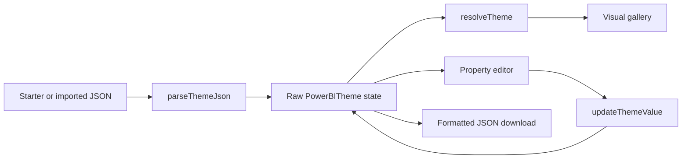

# Power BI Theme Studio — Project Overview

## Purpose

Power BI Theme Studio is a local, browser-only editor for Power BI JSON theme
files. It gives users a quick, representative view of common report visuals,
lets them change a focused set of shared theme tokens, and exports the updated
JSON without discarding unsupported parts of the original theme.

The product is deliberately a first milestone rather than a full Power BI theme
authoring environment. Its current goal is to make safe, visible edits to common
theme properties—not to reproduce Power BI Desktop's rendering engine or support
the whole `visualStyles` schema.

## Current user journey

1. Open the application with the included sample starter theme loaded.
2. Import a Power BI `.json` theme from the browser, or continue with the
   starter theme.
3. Select Card, Bar chart, Table, or Slicer in the visual gallery.
4. Adjust the exposed shared colours, palette, theme name, and relevant type
   size through the property panel.
5. See the representative previews update immediately.
6. Export the current in-memory theme as a formatted JSON file.

Invalid JSON and non-object JSON roots are rejected with a user-facing error.
The **Reset starter** action restores the included starter theme.

## Architecture

The raw `PowerBITheme` object is the source of truth. `resolveTheme` derives the
small, dependable `ResolvedTheme` view model that the previews can render with
safe defaults. The editor writes only the selected JSON path through an immutable
clone, so imported properties outside the current UI remain intact for export.

## Application structure

| Path | Responsibility |
| --- | --- |
| `index.html` | Static HTML document, metadata, favicon, and Vite module entry. |
| `app/main.tsx` | Browser mount point; renders `ThemeStudio` under React `StrictMode`. |
| `app/components/ThemeStudio.tsx` | Import/export handling, active visual state, starter reset, and app composition. |
| `app/components/VisualPreviews.tsx` | Clickable Card, Bar chart, Table, and Slicer previews. |
| `app/components/PropertyEditor.tsx` | Current GUI controls and writes to raw theme paths. |
| `app/lib/theme.ts` | Theme types, parsing, fallback resolution, immutable updates, and export filename creation. |
| `app/globals.css` | All application and preview styling; no component library or CSS framework is used. |
| `public/fixtures/starter-theme.json` | Small shareable development fixture. |
| `tests/static-output.test.mjs` | Checks that a production build emits a static Vite entry point. |

## Theme handling

### Supported input shape

The parser accepts any valid JSON object. It does not perform full Power BI
schema-version validation, which means a real theme can be loaded even when this
first release has no UI for most of its fields.

The resolver currently reads these common tokens:

| Theme path | Use in the application |
| --- | --- |
| `name` | Project label and export filename. |
| `dataColors` | Preview colour palette and palette editor. |
| `background` | Preview canvas background. |
| `foreground` | Preview foreground text colour. |
| `tableAccent` | Table header accent. |
| `textClasses.title.fontSize` | Non-card preview title size. |
| `textClasses.callout.fontSize` | Card callout size. |
| `textClasses.label.color` | Preview muted text colour. |
| `textClasses.label.fontFace` | Preview font family. |

Colours are accepted as six-digit hex strings, with support in the resolver for
Power BI's `{ "solid": { "color": "#RRGGBB" } }` form where it is read.
Invalid or absent values fall back to the starter-theme defaults so previews stay
usable.

### Editable paths

The current GUI can write:

- `name`
- `background`, `foreground`, and `tableAccent`
- The first five values of `dataColors`
- `textClasses.title.fontSize` for Bar chart, Table, and Slicer selections
- `textClasses.callout.fontSize` for the Card selection

The visual selection changes the property-panel context and the typography
control; it does not yet expose separate schema controls for individual visual
parts.

### Preservation behaviour

`updateThemeValue` deep-clones the loaded theme, changes only the requested
path, and returns the clone. This preserves unedited top-level properties,
`visualStyles`, and other unsupported nested sections in the exported JSON.

## Preview coverage

The previews are intentionally representative HTML/CSS renderings rather than
embedded Power BI visuals:

| Preview | Current theme influence |
| --- | --- |
| Card | Title size, callout size, foreground/background, and palette colours. |
| Bar chart | Title size, foreground/background, muted label styling, and palette colours. |
| Table | Title size, foreground/background, muted label styling, and `tableAccent`. |
| Slicer | Title size, foreground/background, muted label styling, and primary palette colour. |

All gallery tiles are keyboard-focusable buttons with an accessible selected
state. The layout adapts from a two-column gallery with a side property panel to
a single-column layout on narrower screens.

## Runtime, build, and deployment

The project is a standard React 19 + TypeScript + Vite 8 single-page
application. It has no server rendering, Worker entry point, database,
authentication layer, or backend API.

| Command | Purpose |
| --- | --- |
| `npm install` | Install the locked project dependencies. |
| `npm run dev` | Start the Vite development server (normally `http://localhost:5173`). |
| `npm run build` | Type-check and create the static production output in `dist/`. |
| `npm run start` | Preview the static Vite build locally. |
| `npm run lint` | Run ESLint. |
| `npm test` | Build, then run the static-output smoke test. |

Node.js 22.13 or newer is required. For Cloudflare Pages, configure the React
(Vite) build settings with build command `npm run build` and output directory
`dist`.

## Testing and validation status

The current automated test verifies that the build emits `dist/index.html`, an
asset module reference, the expected title, and no server-runtime identifiers.
The production build also performs TypeScript checking before Vite bundles the
application.

There are not yet focused unit tests for parsing, resolution, or theme-path
updates, and there is no automated browser interaction test. Those are the most
useful tests to add alongside the next schema-aware editing milestone.

## Theme-file handling and repository hygiene

Real or private themes belong in `themes/local/`, which is Git-ignored. Only
sanitized, shareable examples belong in `themes/examples/`. The bundled starter
fixture is intentionally small and is not a replacement for a complete project
theme.

## Deliberately deferred work

- Full Power BI `visualStyles` schema resolution and validation.
- Direct selection of visual parts such as titles, axes, bars, data labels, and
  gridlines.
- Visual-specific property controls and coverage beyond the four current
  previews.
- Undo/redo, saved editing sessions, and collaboration.
- Pixel-perfect Power BI rendering.

## Recommended next milestone

Start with a schema-aware Bar chart implementation:

1. Resolve actual Bar chart `visualStyles` paths into a dedicated preview model.
2. Add direct selection for the chart title, axes, bars, data labels, and
   gridlines.
3. Map each selected part to narrowly scoped controls that update its real JSON
   path.
4. Add resolver and immutable-update tests for those paths.
5. Preserve all unsupported sections as the current model already does.

Completing one visual end to end will establish the patterns needed to expand
the editor safely to the other visual types.
